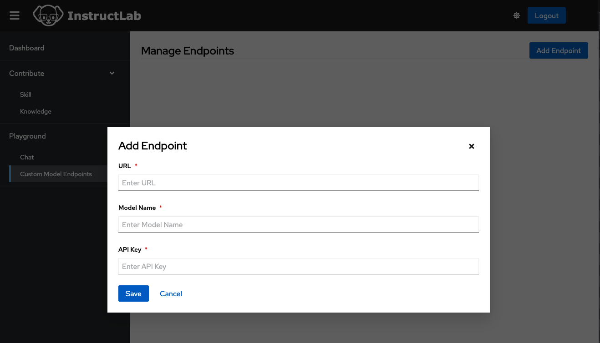
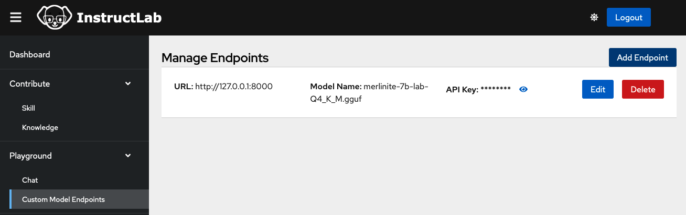
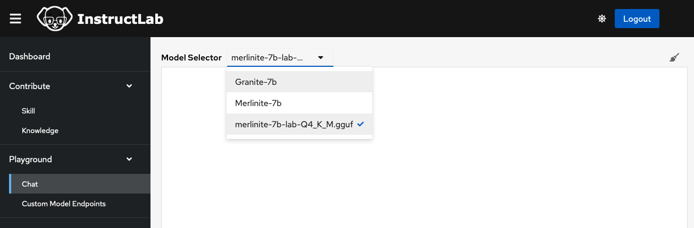
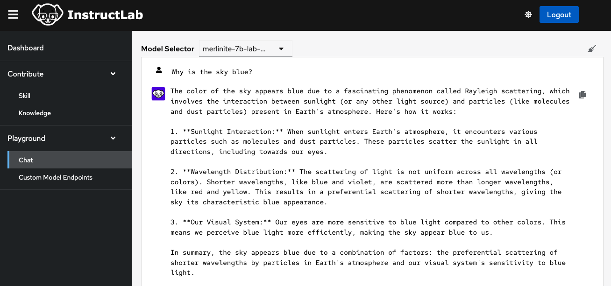

# InstructLab UI Technical Overview

This is a [NextJS](https://nextjs.org) framework with [Patternfly](https://www.patternfly.org/get-started/develop/) UI library components.

## Manually Running the React UI

Set the .env in the ui directory and run the following:

```bash
cd ui/
npm install
npm run dev
# or for prod
npm run build
npm run start
```

## Other helpful NPM Commands

```bash
# Run a production build (outputs to ".next" dir)
npm run build

# Start the Next.js server (run a production build)
npm run start

# Lint the project
npm run lint

# Automatically fix linting issues
npm run lint:fix

# Format code using Prettier
npm run pretty

# Run type checking
npm run type-check
```

## Deploying the UI stack in KIND cluster

Set the .env in the ui directory and run the following:

```bash
make start-dev
```

This will start the kind cluster and deploy the ui stack related manifest files in the cluster.

To stop the kind cluster and delete the ui stack related resources, run the following:

```bash
make stop-dev
```

Use `make help` to see all the available commands.

## OAuth Configuration

You can either set up the Oauth app in your
[GitHub](https://docs.github.com/en/apps/oauth-apps/building-oauth-apps/creating-an-oauth-app)
account or use the user/pass defined in `.env`. To change those defaults, create
the `/ui/.env` file and fill in the account user/pass with the following.

Example [.env](../.env.example) file.

## Local Dev Chat Environment

### 1) Using the ilab command line tool

For the chat functionality to work you need a ilab model chat instance. To run this locally:

`cd server`

[https://github.com/instructlab/instructlab?tab=readme-ov-file#-getting-started](https://github.com/instructlab/instructlab?tab=readme-ov-file#-getting-started)

After you use the `ilab serve` command you should have, by default, a chat server instance running on port 8000.

### 2) Using Podman

#### Current issues

- The docker image that runs the server does not utilise Mac Metal GPU and therefore is very slow when answering prompts
- The docker image is very large as it contains the model itself. Potential to have the model incorporated via a docker volume to reduce the size of the actual image.

`docker run -p 8000:8000 aevo987654/instructlab_chat_8000:v2`

This should run a server on port 8000

### Configuring the chat environment to use a local ilab model chat instance

Return back to the root of the repo (ui) and run `npm run dev` and visit [http://localhost:3000/playground/endpoints](http://localhost:3000/playground/endpoints).

Click the `Add Endpoint` button and a popup modal will appear.



- URL - add `http://127.0.0.1:8000`
- Model Name - add `merlinite-7b-lab-Q4_K_M.gguf`
- API Key - add some random characters

Click the `Save` button



Go to the chat interface [http://localhost:3000/playground/chat](http://localhost:3000/playground/chat) and select the `merlinite-7b-lab-Q4_K_M.gguf` model.



The chat interface should now use the server.


