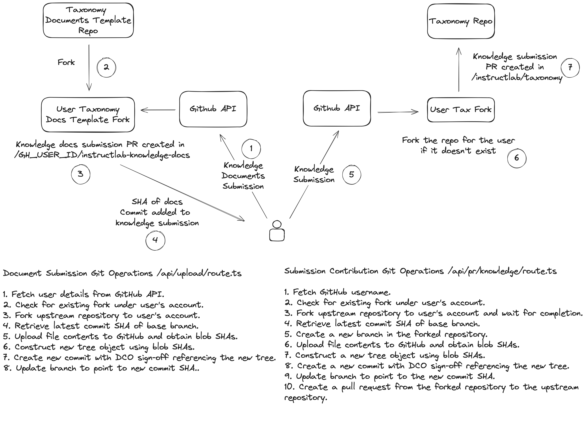

# UI Knowledge Contribution docs

This process has been documented in the graphic by @nerdalert available [below](./ui-knowledge-contribution-workflow.md#), please see that for more information.

## Current contributor workflow for skills

Currently, if teams want to make a contribution they would first navigate to the [taxonomy repo](https://github.com/instructlab/taxonomy).
They would then fork the repo,and follow the [docs](https://github.com/instructlab/taxonomy?tab=readme-ov-file#getting-started-with-skill-contributions)
on getting started with skill contributions. The current process for contributors has many painpoints which has lead to revamping the process as follows.

## Current contributor workflow for knowledge

As with the [knowledge contributions](./ui-knowledge-contribution-workflow.md#current-contributor-workflow-for-skills)

## UI contribution workflow

